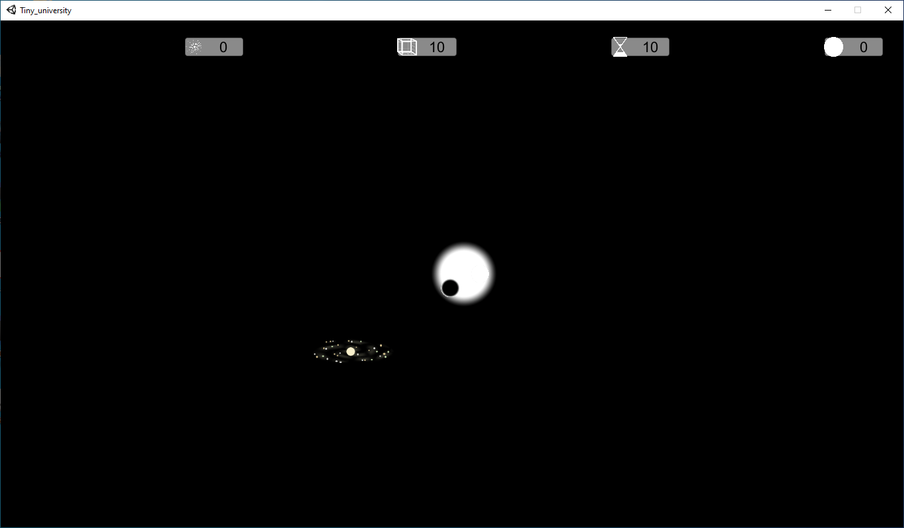
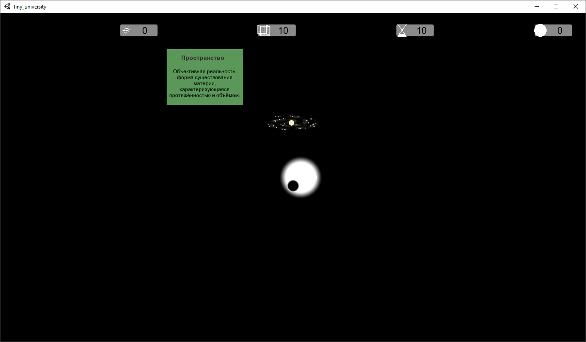
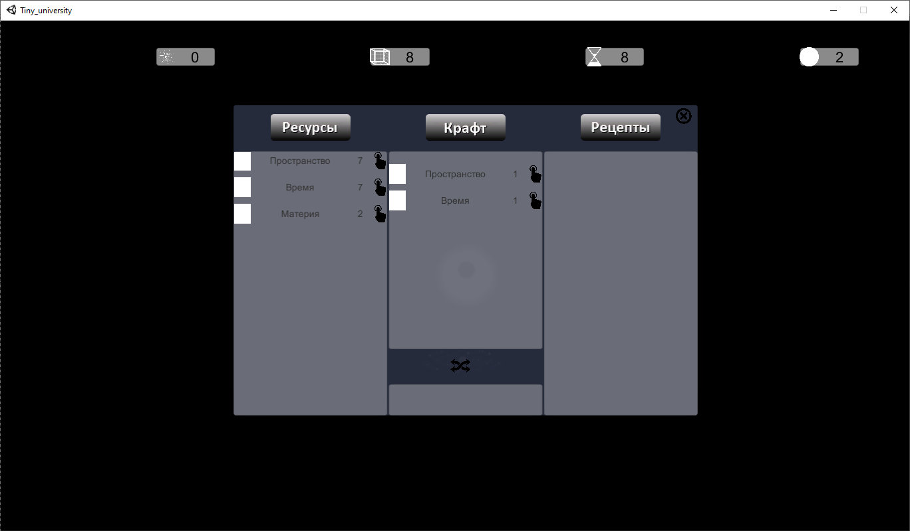
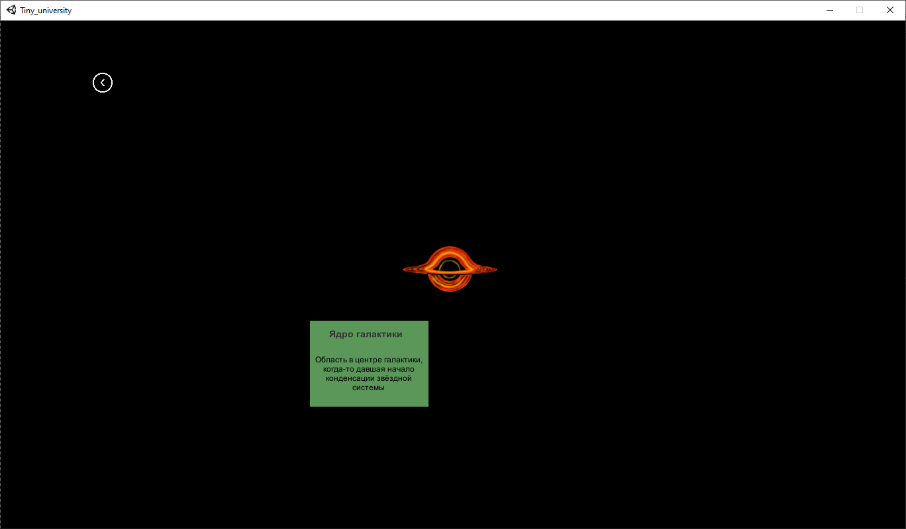

# Project presentation
Project presentation can be founded here: https://drive.google.com/open?id=1o0IwBM2YmDsCzaxrt1H__BblhG7t-M7iXC7GcSFxdTI

# How to build release
For create release that can be used without any DLL files "`Enimga`" util should be used.
Detailed instruction how to pack all `dll` to single `.exe` file can be founded [here](https://unitycoder.com/blog/2019/05/09/creating-single-exe-from-unity-build-files/)

# Tiny universe

## Зміст
<!--ts-->
   * [Про гру](#про-гру)
   * [Як грати](#як-грати)
   * [Реалізація логіки](#реалізація-логіки)
   * [Онлайн гра](#онлайн-гра)
   * [Cкріншоти](#скріншоти)
<!--te-->

## Про гру
**Tiny universe** - це гра стратегія у жанрі пісочниця, для одного гравця. Гравець має можливість відчути себе надістотою, що може створювати нові світи, галактики, планети та зірки! В процесі гри, користувач повинен відкрити багато законів всесвіту задля того, щоб на основі базових ресурсів створювати космічні об'єкти. З перших хвилин на шляху гравця з'являється багато труднощів, адже в самому центрі Всесвіту знаходиться дивна жива тварина, що не тільки дозвляє гравцю отримувати нові ресурси, а ще й хоче дещо натомість! 

 Хто наш гравець
  
Tiny universe - це пісочниця, вона розрахована на тих гравців які люблять створювати щось своє та досліджувати всесвіт що дає гра. Також 
за рахунок спокійної музики та мирної атмосфери гра націлена на релакс.

 Основні механіки
  
  Створення нових ресурсів або об'єктів - у центрі всесвіту гравець об'єднуючи різні ресурси може створювати нові, що потрібні
для створення більш складних об'єктів, а також власне об'єкти. В залежності від ресурсів та їх кількості гравець отримує різні об'єкти.
Наприклад якщо вкласти небагато енергії та хімічних елементів, то вийде коричневий карлик який швидко згасне, а якщо багато - то голубий
гігант, який є зіркою зовсім іншого класу та розміру.

  Еволюція об'єктів - з часом об'єкти або руйнуються або перетворюються на щось інше. Зірка одного класу у кінці свого життя вибухає 
і перетворюється на зірку іншого класу. Планети з часом руйнуються та розсипаються на метеорити, галактики також руйнуються з часом під 
впливом власної гравітації. Після перетворення обо руйнування об'єктів гравець отримує нові ресурси, які він не міг отримати просто
змішуванням того, що в нього є. Наприклад у ядрі зірок проходять термоядерні реакції які утворюють такі нові елементи як оксиген та карбон,
а на планетах утворюються більш складні сполуки як мінерали або вода.

  Рух об'єктів та їх взаємодія - різні тіла взаємодіють один з одним , планети обертаються навколо зірок, зірки навколо центрів галактик, 
а галактики навколо центру всесвіту. Якщо різні об'єкти зіштовхуються, то вони руйнуються.

  Центр галактики - це живий організм, який теж треба годувати, якщо цього не робити, він може знищити наприклад галактику в якій вже був цілий світ.
  
## Як грати
 З самого початку у гравця є тільки 2 ресурси: час та простір. У центрі всесвіту гравець може створити нові ресурси або об'єкти. В грі реалізовано такі перетворення:
час + простір = матерія
простір + матерія = пуста галактика
матерія + час = енергія
матерія + енергія = Н2
Н2 + енергія = зірка
H2 + матерія = планета

Якщо гравець створює зірку, то він може розмістити її в галактиці, а якщо планету - то у сонячній системі.

## Реалізація логіки

## Cкріншоти

